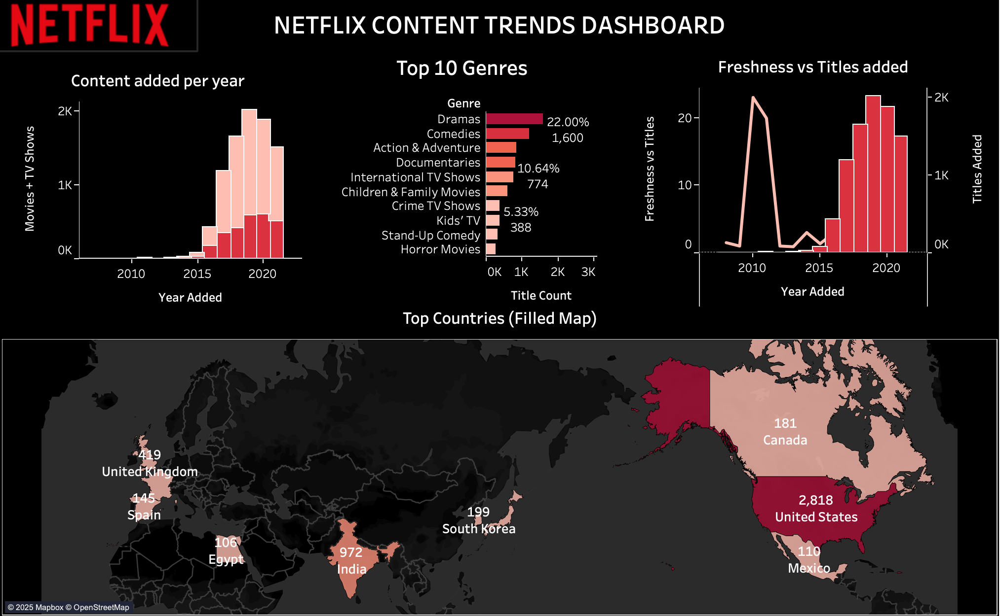

# Netflix Content Trends Dashboard  
*Using SQL & Tableau*  

## Overview  
This project analyzes Netflix’s catalog of movies and TV shows from 2010–2021 to uncover trends in content growth, distribution, and diversity.  
We use SQL to prepare datasets and Tableau for interactive visualizations, combining them into a single dashboard.  

## Dataset  
- Source: [Netflix Movies and TV Shows Dataset (Kaggle)](https://www.kaggle.com/shivamb/netflix-shows)  
- Contains metadata on 8,800+ titles (movies & TV shows), including type, release year, country, rating, duration, genre, cast, and description.  

##  Dashboard Highlights

## Visuals in Dashboard  
1. **Movies vs TV Shows (Pie Chart)** → Overall split of content type.  
2. **Content Added per Year (Bar Chart)** → Growth trend over time.  
3. **Content Added per Year by Type (Stacked Bar)** → Growth trend, split by movies vs TV shows.  
4. **Top Countries (Filled Map)** → Geographic distribution of titles.  
5. **Ratings Distribution (Bar Chart)** → Breakdown of audience ratings.  
6. **Top 10 Genres (Bar Chart)** → Most common genres on Netflix.  
7. **Top 10 Directors (Bar Chart)** → Most frequent directors in Netflix content.  
8. **Top 10 Actors (First Billed) (Bar Chart)** → Actors most often featured in first-billed roles.  
9. **Freshness vs Titles Added (Dual Axis Line + Bar Chart)** → How recent the content was at the time of addition.  

## Key Insights  
- Netflix’s library expanded rapidly after 2015, peaking in 2019.  
- Movies dominate the platform (≈70%) but TV shows have grown steadily.  
- The U.S. and India lead in content production, reflecting regional and global strategies.  
- TV-MA dominates ratings, showing Netflix’s preference for mature audiences.  
- Genres like **Dramas** and **Comedies** are most common worldwide.  
- Bollywood stars (Shah Rukh Khan, Akshay Kumar, Amitabh Bachchan) and Hollywood names (Adam Sandler, Nicolas Cage) both feature in the top actors, reflecting Netflix’s global catalog.  

## How to View Dashboard  
- The Tableau dashboard can be accessed through Tableau Desktop or Tableau Public.  
- Once published to Tableau Public, a shareable link will be added here for easy viewing.

## Reproducibility  
- Data prepared in SQL → exported as CSVs (movies_vs_tv, content_per_year, top_countries, etc.).  
- Visualized in Tableau → combined into a single interactive dashboard.  

## References  
- Dataset: Shivam Bansal, *Netflix Movies and TV Shows Dataset* (Kaggle).  
- Tools: Tableau (visualization), SQL (data preparation).  

